# Agentic AI (Autonomous AI Agents)

## Summary
Agentic AI systems are autonomous agents that can understand goals, plan actions, execute them across various tools, evaluate results, and adapt their approach to accomplish complex tasks with minimal human supervision.

## Context
Use when applications require AI systems that can autonomously work on complex tasks that need multi-step reasoning, tool usage, planning, and persistence. Especially valuable when human-like problem-solving capabilities are needed.

## Problem
Traditional LLMs are limited to single-turn responses without memory, planning capabilities, or the ability to use tools autonomously. They cannot adapt to changing contexts or pursue multi-step goals with persistence.

## Solution
Create architectures that enable AI agents to plan, reason, use tools, maintain memory, and autonomously work toward a defined objective through multiple rounds of action and reflection.
## Agentic Framework Components

### 🧠 An Agent
What is an agent? 

An agent consists of the following logical Components:-

#### **Prompts**
Receives user input and instructions that trigger agent behavior.

#### **Reasoning/Excution**
Encapsulated in two stages:

- **Logic**: Interprets the prompt, plans actions, and selects paths (e.g., tool vs memory vs retrieval).
- **Execution**: Carries out the selected plan or responds with output.

#### **Reflection**

Evaluates the output of execution to determine if it meets the objective.
If not, it loops back into the reasoning stage to refine or retry the approach.
This enables self-correction and improvement over time.

#### **LLM Model (External)**
Provides the agent with natural language understanding, reasoning, and planning capabilities  
(e.g., OpenAI GPT-4, Anthropic Claude, Gemini, etc.).

#### **Knowledge**
Performs contextual retrieval using Retrieval-Augmented Generation (RAG) techniques.  
Connects to an external vector database for relevant context.

#### **Storage**
Handles memory and persistence (e.g., chat history, prior interactions).  
Connects to a persistent database for long-term memory.

#### **Tools**
Executes actions such as API calls, data lookups, or system integrations.  
Interfaces with external systems like APIs and Managed Control Planes (MCPs).

### Tools & Abilities
- **Tool Library** - Collection of specialized tools the agent can access (e.g., code execution, database access, web search, file operations)
- **Tool Selection Logic** - Determines which tool to use for specific subtasks
- **Tool Use Interface** - Standardized way for the agent to invoke tools and process their responses
- **Execution Environment** - Sandboxed environment where tools can be safely executed

### 🤖 Multi Agent Systems

What is actually happening is that there is an orchestrator that coordinates work and communication between the agents, as shown below.

```mermaid
flowchart TD
    Human["🧑 Human Feedback/Loop"]

    subgraph Orchestrator["🧠 Orchestrator"]
        WF["Workflow/Cordinator Agent/Hardcode<br/>(Includes Monitoring)"]        
    end

    subgraph Agents["Multi-Agents"]
        A1["Agent 1"]
        A2["Agent 2"]
        AN["Agent N"]
    end

    Human <--> Orchestrator

    Orchestrator --> A1
    Orchestrator --> A2
    Orchestrator --> AN

```

- **Orchestrator** - Manages the agent's workflow, task decomposition, and subtask delegation (can be hard-coded execution)
- **Task Queue** - Prioritizes and manages tasks to be completed by the agent
- **Progress Monitoring** - Tracks task completion and detects failures or blockers
- **Human Feedback Loop Integration** - Mechanism for incorporating human guidance when necessary

## Benefits
- Autonomous task completion without constant human intervention
- Ability to solve complex problems requiring multi-step reasoning
- Adaptability to changing conditions or requirements during task execution
- Persistent effort toward goals despite obstacles
- Integration with various tools to extend capabilities beyond language generation

## Trade-offs
- Higher computational cost compared to simple LLM prompting
- Complex orchestration systems required for reliability
- More difficult to predict agent behavior compared to deterministic systems
- Security challenges when allowing autonomous tool usage
- May require fallback to human intervention in ambiguous situations

## 🧠 Agentic Frameworks that  support these components

🔑 Legend

| Symbol | Meaning                                               |
|--------|--------------------------------------------------------|
| ✔️     | Fully supported / built-in feature                     |
| 🧩     | Partially supported / possible via composition / manual |
| ❌     | Not supported / must be implemented yourself            |

---

### Single-Agent Components

| Component                           | CrewAI | AutoGen | LangGraph | Agno | SmolAgents | Mastra | PydanticAI | Atomic Agents | Notes |
|------------------------------------|--------|---------|-----------|------|-------------|--------|-------------|----------------|-------|
| Prompts (Instructions)             | ✔️     | ✔️      | ✔️        | ✔️   | ✔️          | ✔️     | ✔️          | ✔️              | All support structured prompt injection |
| Reasoning (Interpret / Plan)       | ✔️     | ✔️      | 🧩        | 🧩   | 🧩           | 🧩     | ❌          | 🧩              | LangGraph uses graph logic; Agno uses LLM + orchestration |
| Execution (Act / Output)           | ✔️     | ✔️      | ✔️        | ✔️   | ✔️          | ✔️     | 🧩          | ✔️              | PydanticAI requires manual handlers |
| Reflection                         | ✔️     | ✔️      | 🧩        | 🧩   | ❌           | ❌     | ❌          | 🧩              | CrewAI/AutoGen have native loops; Agno via eval |
| Tools                              | ✔️     | ✔️      | 🧩        | ✔️   | ✔️          | ✔️     | ❌          | 🧩              | LangGraph through nodes; others support tool calls |
| Knowledge (RAG / Vector DB)        | 🧩     | 🧩      | ✔️        | 🧩   | ❌           | ❌     | ❌          | ❌              | LangGraph native; others allow integration |
| Storage (Memory / Persistence)     | ✔️     | ✔️      | ✔️        | ✔️   | ❌           | ❌     | ❌          | ❌              | CrewAI/AutoGen built-in; Agno uses drivers |
| LLM Model Integration              | ✔️     | ✔️      | ✔️        | ✔️   | ✔️          | ✔️     | ✔️          | ✔️              | All frameworks support LLMs |
| External APIs / Systems            | ✔️     | ✔️      | 🧩        | ✔️   | ✔️          | ✔️     | 🧩          | 🧩              | Most support calls; LangGraph via nodes |
| Monitoring / Observability         | 🧩     | 🧩      | 🧩        | ✔️   | ❌           | ❌     | ❌          | ❌              | Agno provides native dashboards and integrations (Langtrace, Arize, AgentOps, Portkey) |

---

### Multi-Agent Coordination

| Component                          | CrewAI | AutoGen | LangGraph | Agno | SmolAgents | Mastra | PydanticAI | Atomic Agents | Notes |
|-----------------------------------|--------|---------|-----------|------|-------------|--------|-------------|----------------|-------|
| Orchestrator / Workflow Engine    | ✔️     | ✔️      | ✔️        | 🧩   | ❌           | ❌     | ❌          | 🧩              | LangGraph orchestration-first; Agno supports via Team and workflows |
| Multi-Agent Composition           | ✔️     | ✔️      | ✔️        | ✔️   | 🧩           | 🧩     | ❌          | 🧩              | Agno supports Teams and Workflows |
| Human Feedback / Interaction Loop | ✔️     | ✔️      | 🧩        | 🧩   | ❌           | ❌     | ❌          | ❌              | CrewAI/AutoGen native; Agno via manual injection |
| Monitoring / Logging of Agents    | 🧩     | 🧩      | 🧩        | ✔️   | ❌           | ❌     | ❌          | ❌              | Agno includes observability with integrations |

