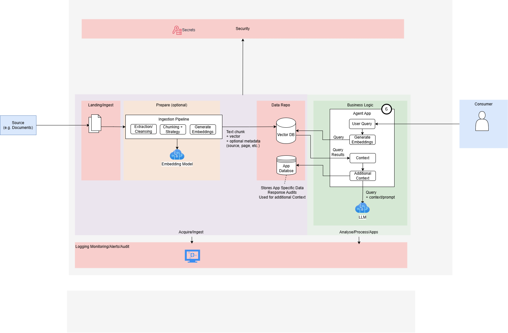
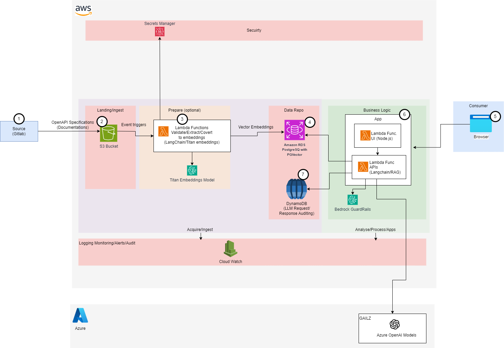

# Retrieval-Augmented Generation (RAG)

## Summary
RAG enhances LLM responses by retrieving relevant data from external sources before generating answers.

## Context
Use when the LLM needs to answer questions with accurate, up-to-date, or private domain-specific information that isn't part of its training data.

## Problem
LLMs are limited to their training data and can hallucinate or provide outdated answers. RAG bridges this gap by injecting retrieved documents into the generation process.

## Solution
Combine vector-based document retrieval with LLM prompting to provide grounded and context-rich responses.

## Diagram

## Components
### Ingestion
- **Souce (1)** - Source data such as documents are ingested
- **Ingestion Pipeline (2)** - This takes the source data such as documents, cleanses the data, chunks it up using a chunky strategy then converts the chunks to embeddings using an Embedding Model. The text chunk, its assoicated emeddings and additional metadata are then pushed to the Vector Database
- **Vector Store/Database (3)** - Stores the vector embeddings and its associated metadata   
### Agent App (5)
- **User Query** – chat/web interface to input query
- **Retriever and Prompt Builder** – converts query to embedding and fetches similar documents, in addition it access the appliation database to retrieve additional context (e.g. personalisation info, prompt history etc) to build the full context before passing to the LLM
- **LLM Engine** – OpenAI, Azure OpenAI, etc., receives retrieved context + original query
- **App Database** – Stores application specific information such as user details, chat history that can be used for additional context. This is used by the prompt builder to build additional context.

## Benefits
- Domain-specific knowledge without retraining
- Improves accuracy and reduces hallucination
- Easily updateable context without touching the LLM

## Trade-offs
- Latency increases due to retrieval step
- Requires vector store and embedding pipeline
- May retrieve noisy or irrelevant documents if not tuned well

## Cloud-Specific Implementation

### Azure
- Embeddings: Azure OpenAI + `text-embedding-ada-002`
- Vector Store: Azure AI Search or Redis
- LLM: Azure OpenAI `gpt-35-turbo` or `gpt-4`
- Flow: Azure Functions or FastAPI on Azure App Service

### GCP
- Embeddings: Vertex AI Embedding API
- Vector Store: Vertex AI Matching Engine
- LLM: Vertex AI PaLM or Gemini
- Flow: Cloud Functions / Cloud Run

### AWS

- Embeddings: Bedrock with Titan Embeddings
- Vector Store: OpenSearch or Amazon Kendra or PostGres pgVector
- LLM: Anthropic Claude via Bedrock, OpenAI
- Flow: Lambda + API Gateway
- GuardRails - Controls to prevent harmful content and filer out PII data

## Related Patterns
- Semantic Search
- Hybrid Search (BM25 + Embeddings)
- Knowledge Base Integration

## References
- TODO

## Proof of Concepts(PoCs)/Accelators
### Red-bar-Tool
An AI assistant that extracts and answers legal questions from contracts using RAG architecture.
- [Red-bar-tool-backend](https://github.com/eSynergy-Solutions/red-bar-tool-backend) – CloudRun, GCP Gemini with Postgres PgVector

- [Red-bar-tool-frontend](https://github.com/eSynergy-Solutions/red-bar-tool-frontend) – CloudRun and GCP Gemini with Postgres PgVector

- AWS - deployment TODO...
- Azure - deployment TODO..
- GCP - deployment
  - [Frontend](https://github.com/eSynergy-Solutions/red-bar-tool-frontend/tree/main/iac/gcp)
  - [Backend](https://github.com/eSynergy-Solutions/red-bar-tool-backend/tree/main/iac/gcp)
