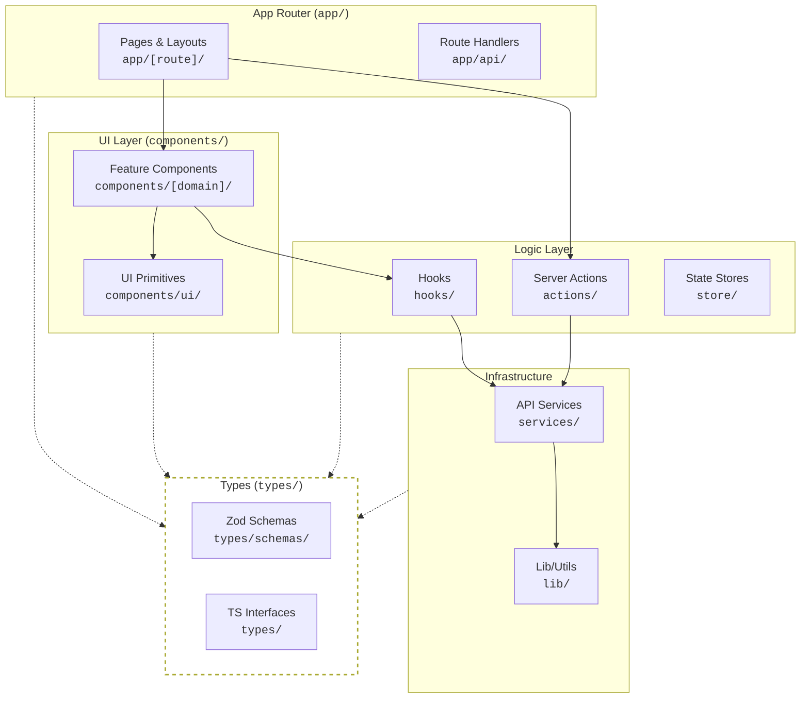
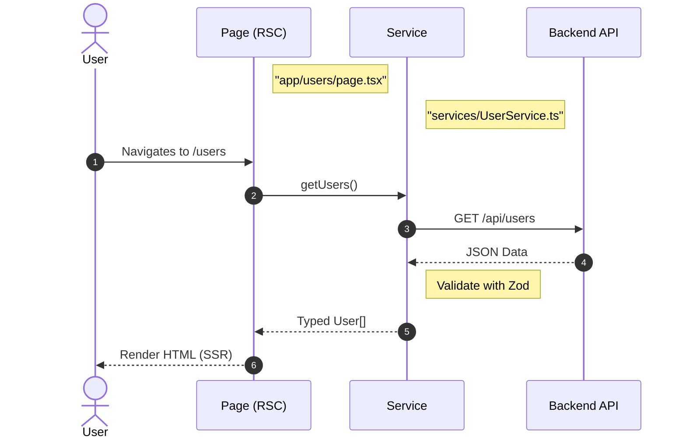
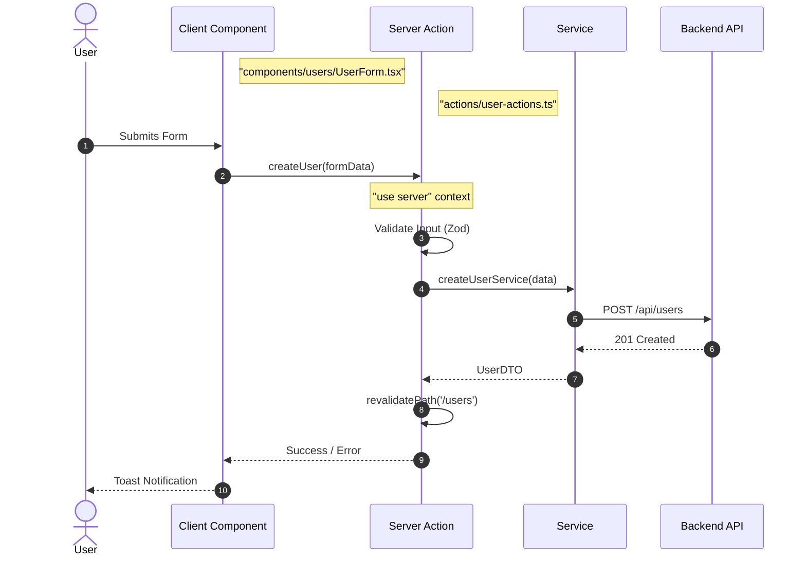
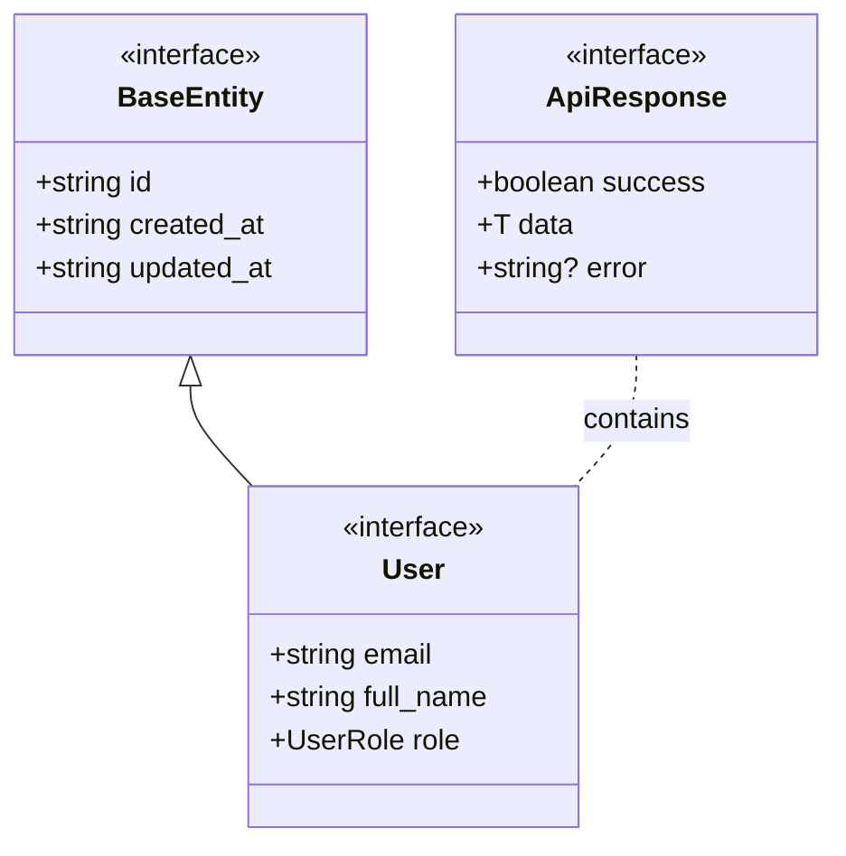

# Next.js Frontend/BFF Implementation Standards

## Packages Structure

This diagram represents a layered frontend/BFF architecture using Next.js App Router principles.
Each box represents a directory, and arrows show allowed directional dependencies.

---

## 📦 Layer Overview

| Layer     | Folder/Package | Description                                                                 |
|-----------|----------------|-----------------------------------------------------------------------------|
| **App**   | [`app`](app )         | Next.js App Router. Contains `page.tsx`, `layout.tsx`, and `route.ts`. Responsible for routing and initial data fetching (Server Components). |
| **UI**    | `components/`  | React components. Split into `ui` (shadcn/atomic) and domain-specific feature folders. |
| **Actions**| `actions/`    | Server Actions (`"use server"`). Handles form submissions and mutations securely on the server. |
| **Hooks** | `hooks/`       | Custom React hooks (`"use client"`). Encapsulates client-side logic, side effects, and local state. |
| **Services**| `services/`  | Typed API clients. Wrappers around `fetch` to communicate with the Backend API. Can be manually written or **generated via OpenAPI**. |
| **Types** | `types/`       | TypeScript definitions and Zod schemas. Shared across the application to ensure type safety. |
| **Lib**   | `lib/`         | Shared utilities: `cn()`, date formatters, fetch wrappers, and environment config. |

---

### 📚 Component Details

| Component     | Directory        | Purpose                                                                 | Naming Convention | Returns         | Can Call                                                                                   |
|---------------|------------------|-------------------------------------------------------------------------|------------------|-----------------|--------------------------------------------------------------------------------------------|
| **Page**      | `app/[route]/`   | Entry point for a route. Fetches initial data (RSC).                    | `page.tsx`       | `JSX.Element`   | **Actions**, **Services**, **Components**                                                  |
| **Server Action**| `actions/`    | Server-side functions callable from client. Handles mutations.          | `<domain>-actions.ts`| `Promise<Result>`| **Services**, **Lib**                                                                     |
| **Feature Comp**| `components/[domain]/`| Domain-specific UI logic (e.g., UserProfile, DashboardChart).     | `<Name>.tsx`     | `JSX.Element`   | **Hooks**, **UI Primitives**                                                               |
| **Service**   | `services/`      | HTTP client for external APIs (Backend). Adds auth headers/error handling.| `<Domain>Service.ts`| `Promise<DTO>`  | **Lib** (fetch wrapper)                                                                    |
| **Hook**      | `hooks/`         | Reusable client logic (state, effects).                                 | `use<Name>.ts`   | State/Methods   | **Services** (via client fetch), **Lib**                                                   |
| **Zod Schema**| `types/schemas/` | Runtime validation schemas (forms/API responses).                       | `<Name>Schema`   | Zod Object      | —                                                                                          |

---

### 🔑 Notes
- **Server Components (RSC)** should do the heavy lifting for initial data fetching.
- **Client Components** should be leaf nodes where possible, used only for interactivity.
- **Services** must be agnostic of React; they are pure TS functions returning Promises.
- **Zod Schemas** should match the Backend schemas (e.g. Pydantic, Java Records, etc).

## OpenAPI / Swagger Integration

This architecture supports generating the **Services** and **Types** layers directly from the Backend's OpenAPI spec (e.g., using `orval`, `openapi-typescript-codegen`, or `@hey-api/client-fetch`).

| Component | Manual Approach | OpenAPI Generated Approach |
|-----------|-----------------|----------------------------|
| **Types** | Manually define interfaces in `types/` matching Backend models. | Auto-generate TS interfaces from OAS `components/schemas`. |
| **Services**| Manually write `fetch` wrappers in `services/`. | Auto-generate typed SDK/Clients in `services/generated/`. |
| **Zod** | Manually write Zod schemas. | Auto-generate Zod schemas from OAS for runtime validation. |

**Integration Rule:** If using a generator, treat the generated code as a "Service". Do not import generated clients directly into UI components; wrap them in **Server Actions** or **Hooks** to maintain architectural boundaries.

## Data Interaction Patterns

### Server Component Fetching (RSC)
Preferred pattern for initial page loads.

### Client Mutation (Server Actions)
Preferred pattern for forms and updates.

## Base Types
Types should mirror the backend models but be optimized for frontend usage.

