# Python Micro Services Backend Implementation Standards

## Packages Structure

This diagram represents a layered backend architecture using Domain-Driven Design (DDD) principles.  
Each box represents a package (folder/module), and arrows show allowed directional dependencies (who can call or use whom).

The agentic layer is a new additional optional layer.

---

## 📦 Layer Overview

| Layer     | Folder/Package | Description                                                                 |
|-----------|----------------|-----------------------------------------------------------------------------|
| **API**   | `api/`         | Exposes FastAPI routes, receives HTTP input, delegates to biz. Uses schemas and models. |
| **Schemas** | `schemas/`   | Defines Pydantic request/response schemas. Used for input/output validation. Maps to/from domain models. |
| **Core**  | `core/`        | Shared application utilities and common infrastructure: configuration, custom logging, and exceptions. |
| **Biz**   | `biz/`         | Contains domain logic. Coordinates workflows, enforces rules. Delegates DB access to data/, uses model/. |
| **Services** | `biz/services/` | Implements specific business use cases like registration, login, verification. |
| **Data**  | `data/`        | Handles persistence (e.g. repository classes). Accessed only by the biz layer. |
| **Model** | `model/`       | Contains core domain entities (e.g., User, Status, Token). Used by both api, schemas, and biz. |
| **Agentic** | `agentic/`   | Encapsulates agent/AI capabilities: agents, RAG/knowledge, tools (MCP), llm adapters, and workflows. Can call Biz and Core Layers. This is only rquired if agentic or agents are used |
| **MCP (Model Context Protocol)** | `mcp/` | Standardized protocol and schemas that define how agents and tools exchange context, inputs, and outputs; supports tool registration and runtime message exchange. |

---

### 📚 Component Details

| Component     | Directory        | Purpose                                                                 | Naming Convention | Returns         | Can Call                                                                                   |
|---------------|------------------|-------------------------------------------------------------------------|------------------|-----------------|--------------------------------------------------------------------------------------------|
| **API Layer** | `api/`           | Handles HTTP/gRPC requests, routing, request validation, and response formatting. | `<name>_api` or `<domain-name>_api`    | Schema Response | Calls **Services**, **Query**. Uses **Schemas** and **Models** (converts requests to models). |
| **Schemas**   | `schemas/`       | Defines request/response DTOs and validation rules.                     | `<Name>Schema`   | `<name>Response` (Pydantic) | —                                                                                          |
| **Model**     | `model/`         | Core entity definitions, shared across layers.                          | `<Name>Model`    | ORM Entities    | —                                                                                          |
| **Data Layer**| `data/`          | Data access logic; repositories that talk to the database.              | `<Name>Repository` | ORM / Raw Data  | **Model**                                                                                  |
| **Services**  | `biz/services/`  | Core business logic with write/update capabilities.                     | `<Domain-Name>Service` e.g. UsersService  | **Model**       | **Model**, **Data Layer**                                                                  |
| **Query Services** | `biz/query/`| Read-only aggregation across models and data layer; optimized for frontend responses. | `<Domain-Name>Query` e.g. UsersQuery   | **DTO**         | Calls **Data Layer**, uses **DTO** (⚠️ does not use **Model**)                             |
| **DTOs**      | `dto/`           | Lightweight data objects optimized for returning to the frontend.        | `<Name>DTO`      | **DTO**         | Used by **Query Services** and **APIs**                                                    |
| **Agentic**   | `agentic/`       | AI/agent capabilities: orchestrates LLM agents, RAG/knowledge access, tools (MCP), model adapters, and workflows. | `<Name>Agent` / `<Name>Tool` | Varies (DTO/Model/Side-effects) | Can call **Biz**, **Core Layers** (Model, Data, DTO, Schemas) and external systems. |
| **Agentic - Agents** | `agentic/agents/` | LLM-driven agents that implement task-specific logic and coordinate external calls. | `<Name>Agent` | DTO / Model / Side-effects | Calls **agentic/tools**, **agentic/knowledge**, **biz**, and **core layers** as needed. |
| **Agentic - Tools**  | `agentic/tools/`  | Tooling and integrations exposed to agents (MCP, external service adapters, action executors). | `<Name>Tool`  | Side-effects / external calls | Called by **agentic/agents** and **agentic/workflow**. |
| **Agentic - Workflow**| `agentic/workflow/`| Orchestration and composition utilities for agent flows (step sequencing, retries, error handling). | `<Name>Workflow` | Side-effects / DTOs | Calls **agentic/agents**, **agentic/tools**, and **biz** for composed operations. |
| **Core - Config** | `core/config.py` | Application configuration helpers (env loading, typed settings, secrets handling). | `get_settings()` / `Settings` | Config values (dict or Pydantic model) | Used by **API**, **Biz**, **Data**, and **Agentic** layers. |
| **Core - Custom Logging** | `core/custom_logging.py` | Centralized logging configuration and helpers (structured logging, formatters, request/context enrichment). | `setup_logging()` | Configures root/logger handlers | Used across the application (API startup, background workers). |
| **Core - Exceptions** | `core/exceptions.py` | Application-specific exception types and mapping utilities for consistent error handling. | `AppError`, `NotFoundError` | Exception classes | Raised by Biz/Data layers and mapped to HTTP responses in API. |
| **MCP (Model Context Protocol)** | `mcp/` | Standardized protocol and schemas that define how agents and tools exchange context, inputs and outputs (tool registration, tool metadata, and message exchange). | `<Name>MCP` | Tool descriptors, messages, input/output schemas | Used by **agentic/agents**, **agentic/tools** and **agentic/workflow**. |
---

### 🔑 Notes
- API Layer must **only expose schema responses** (or requests).  
- Services return **Models**, Queries return **DTOs**.  
- Query services **must not use Models** directly.  
- DTOs are lightweight and tailored for frontend responses.  

## Biz Service Scenarios
### Query Pattern

```mermaid
sequenceDiagram
    autonumber
    actor User as Caller
    participant API
    participant Query
    participant Repo

    Note right of API: "e.g. Users API"<br/>api/users_api.py
    Note right of Query: "e.g. UsersQuery"<br/>biz/query/users_query.py
    Note right of Repo: "e.g. UsersRepository"<br/>data/users_repository.py

    User->>API: GET /users/me/profile (Authorization: Bearer <token>)
    API->>Query: get_user_profile(user_id)
    Query->>Repo: fetch_user_by_id(user_id)
    Repo-->>Query: UserRecord (raw DB row)
    Note right of Query: Map raw data → UserProfileDTO<br/>⚠ does not use Model
    Query-->>API: UserProfileDTO
    Note over API,Query: API maps DTO → UsersProfileResponse (schema)
    API-->>User: 200 OK (UsersProfileResponse)
```

### Service Pattern

```mermaid
sequenceDiagram
    autonumber
    participant User
    participant API
    participant Service
    participant Repo

    Note right of API: "Users API"<br/>api/users_api.py
    Note right of Service: "UsersService"<br/>biz/services/users_service.py
    Note right of Repo: "UsersRepository"<br/>data/users_repository.py

    User->>API: POST /users/me/register (UserCreateSchema)
    Note right of API: Validate with Schemas<br/>schemas/users.py
    API->>Service: register_user(UserCreateSchema)
    Note over Service: Enforce business rules
    Service->>Repo: create_user(UserModel)
    Repo-->>Service: Persisted UserModel
    Service-->>API: UserModel
    Note over API,Service: API maps Model → UsersRegisterResponse (schema)
    API-->>User: 201 Created (UsersRegisterResponse)
```

## Agentic interaction patterns

Below are two common patterns for how API, Agentic components, and the Biz/Core layers interact.

### Tools pattern
#### 1. API -> Agent -> Tools -> Service/Query

Notes: this pattern keeps agents thin orchestrators that delegate side-effects to tools. Tools should encapsulate retry/error handling and adapt Biz/Query calls as needed.

### Agentic workflow pattern
#### 1. API -> Workflow -> Service/Query and agents

Notes: the workflow component composes multiple steps. Agents are used as sub-steps; the workflow may also call Biz services or queries directly. This pattern is useful when you need deterministic orchestration, retries, or human-in-the-loop steps.

## Base Entity Models
All Models should inherit the base entity attributes.

