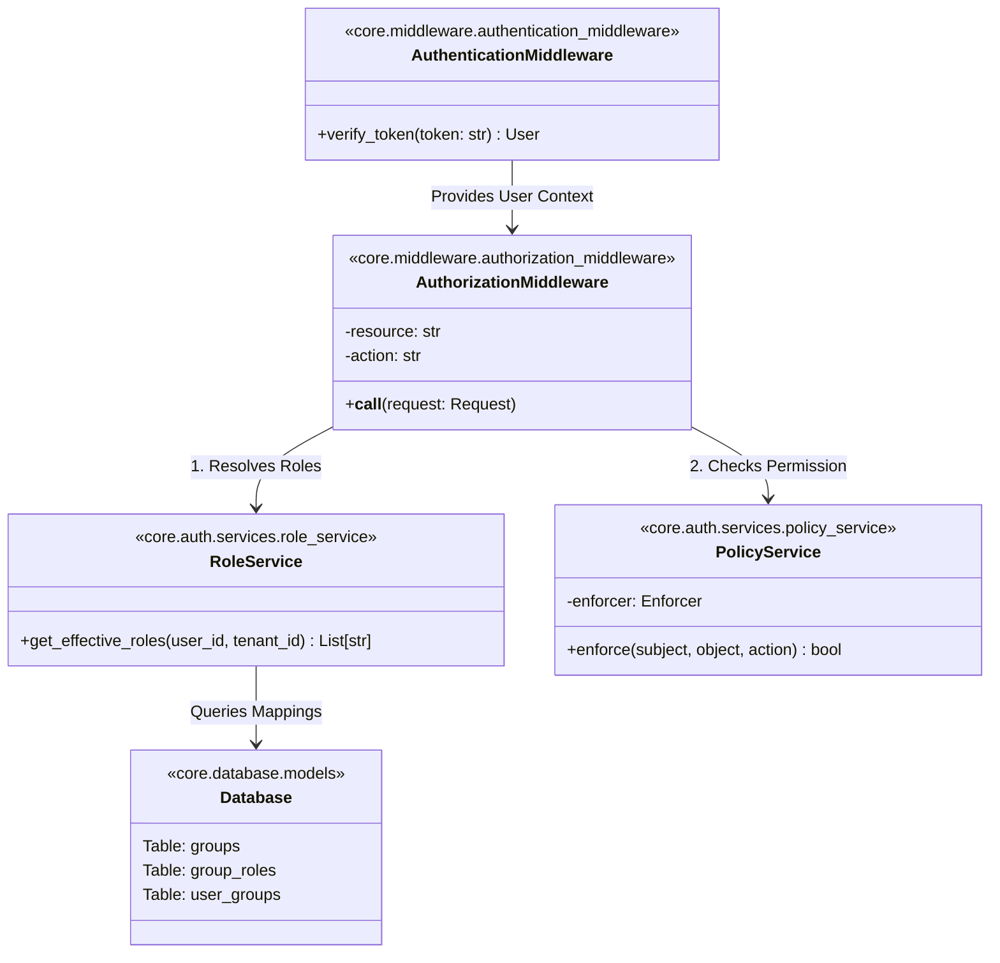
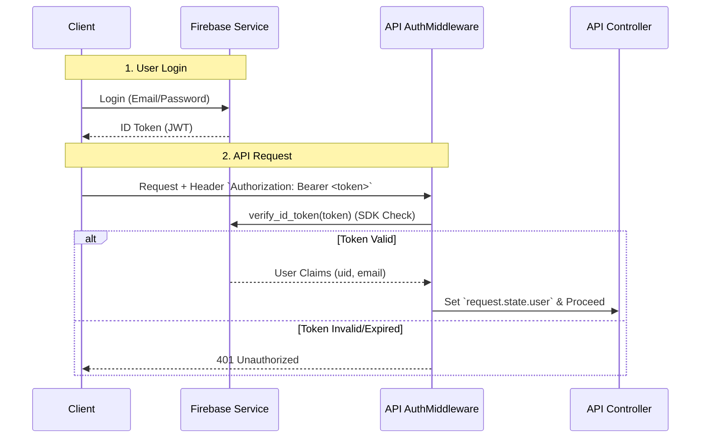
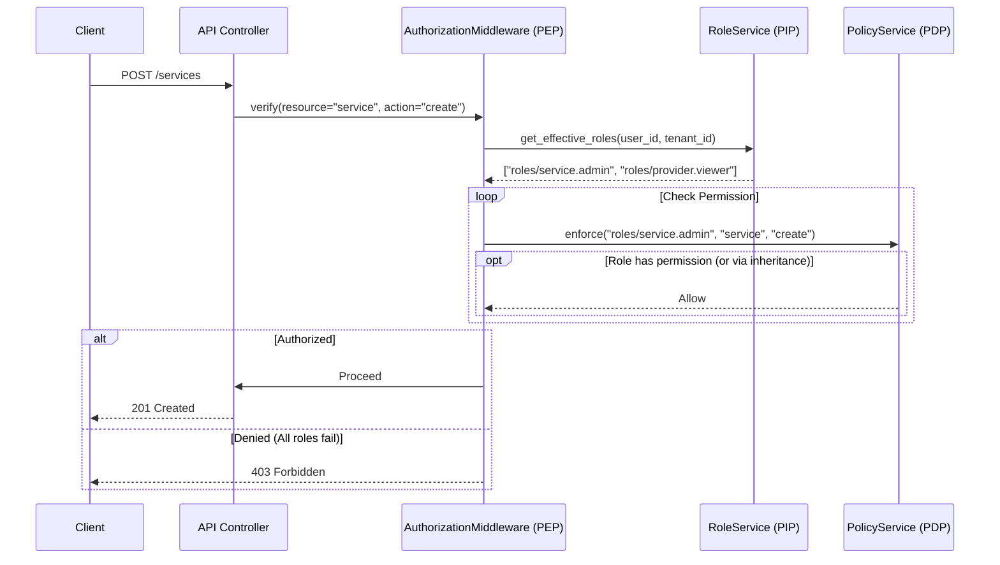

# Authentication & Authorization Design

## 1. Overview
This document outlines the design for the Authentication (AuthN) and Authorization (AuthZ) systems within the BookingApp Backend. The system leverages **Firebase Authentication** for identity verification and **Casbin** for Role-Based Access Control (RBAC).

## 2. Architecture & Strategy
The architecture is designed to decouple identity management from access control while maintaining strict tenant isolation. It follows standard **NIST RBAC** and **XACML** architectural patterns.

### 2.1 Key Components (NIST / XACML Mapping)
*   **Identity Provider (IdP)**: **Firebase**. Handles user authentication, credential management, and token issuance (JWT).
*   **Authentication Middleware**: Verifies the identity token (AuthN).
*   **Policy Enforcement Point (PEP)**: **AuthorizationMiddleware** (or Guard). Intercepts requests to enforce access rules based on limits.
*   **Policy Decision Point (PDP)**: **PolicyService** (Casbin). The engine that evaluates `(user_roles, resource, action)` against the policy to make an Allow/Deny decision.
*   **Policy Information Point (PIP)**: **RoleService**. The source of attributes (e.g., user roles) needed for the decision.
*   **Policy Store**: A static `policy.csv` file defining global rules and role hierarchies.
*   **Role Store**: The primary database (PostgreSQL) storing dynamic tenant-specific user-to-group mappings.

### 2.2 Design Principles
1.  **Logical Resource Mapping**: Policies map to logical resources (e.g., `booking`, `service`) rather than raw URL paths, decoupling security from routing structure.
2.  **Global Static Roles**: A predefined set of system roles (e.g., `roles/booking.admin`, `roles/provider.viewer`) are static across all tenants.
3.  **Dynamic Groups**: Tenants manage their own user groups dynamically. These groups map to static system roles.

---

## 3. Data Models

### 3.1 Casbin Policy Model
We utilize a standard RBAC model with hierarchy support.

**`rbac_model.conf`**
```ini
[request_definition]
r = sub, obj, act

[policy_definition]
p = sub, obj, act

[role_definition]
g = _, _

[policy_effect]
e = some(where (p.eft == allow))

[matchers]
m = g(r.sub, p.sub) && r.obj == p.obj && r.act == p.act
```

**`policy.csv` (GCP IAM Style)**

Example:
```csv
# Format: p, role, resource, action
# Permissions use <resource>.<verb> convention
p, roles/booking.admin, booking, create
p, roles/booking.admin, booking, update
p, roles/booking.admin, booking, delete
p, roles/booking.viewer, booking, get
p, roles/booking.viewer, booking, list

# Inheritance: Job Roles include technical roles
g, group:super_admin, roles/booking.admin
g, group:admin, roles/booking.admin
g, group:customer_support, roles/booking.viewer
```

### 3.2 Database Schema (Role Resolution)
Dynamic mapping of Users -> Tenant Groups -> System Roles.

**Table: `groups`**
| id (PK) | tenant_id (FK) | name |
|---|---|---|
| `g1` | `tenant_A` | "Managers" |

**Table: `group_roles`**
| group_id (FK) | role_key | Description |
|---|---|---|
| `g1` | `roles/booking.admin` | Managers get Booking Admin role |

**Table: `user_groups`**
| user_id | group_id (FK) |
|---|---|
| `user_123` | `g1` |

---

## 4. Component Design (Static Structure)

### 4.1 Class Diagram
This diagram illustrates the static relationship between the authentication middleware, permission dependencies, and underlying services.



---

## 5. Runtime Logic (Dynamic Flow)

### 5.1 Authentication Sequence (Identity Verification)
The **Authentication** process ensures the user is who they say they are before any access checks occur.



### 5.2 Authorization Sequence (Access Control)
The **Authorization** process determines if the authenticated user has permission for the requested resource.

1.  **Identity Extraction**: `AuthenticationMiddleware` validates the JWT and extracts `user_id`.
2.  **Role Resolution (PIP)**: `RoleService` queries the DB for all unique system roles associated with the user's groups in the current tenant.
3.  **Policy Enforcement (PDP)**: `PolicyService` evaluates if *any* of the user's resolved roles grant the required permission on the requested resource.

### 5.3 Authorization Sequence Diagram



---

## 6. Implementation Examples

### 6.1 FastAPI Usage
Developers protect routes using the `AuthorizationMiddleware` dependency factory (often aliased as `Authorized` or `RequirePermission`).

```python
from fastapi import APIRouter, Depends
from core.auth.dependencies import AuthorizationMiddleware

router = APIRouter()

@router.post("/services")
async def create_service(
    data: ServiceCreateDTO,
    # Explicitly map route to Logical Resource & Action
    auth: UserContext = Depends(AuthorizationMiddleware("service", "create")) 
):
    """
    Creates a new service.
    Required Permission: p, <role>, service, create
    """
    return svc.create_service(data)
```

#### How it Works:
1.  `AuthorizationMiddleware("service", "create")` defines the standard of proof (PEP).
2.  The runtime finds the user has roles `["roles/service.admin"]` (via RoleService/PIP).
3.  It calls Casbin (PolicyService/PDP): `enforce("roles/service.admin", "service", "create")`.
4.  Casbin checks `policy.csv` for `p, roles/service.admin, service, create`.
5.  Match found -> Access Granted.

### 6.2 Optimization Notes
*   **Role Caching**: The result of `RoleService.get_effective_roles` should be cached (Redis/Memory) keyed by `(user_id, tenant_id)` to minimize database load.
*   **Distinct Query**: The SQL query for roles uses `DISTINCT` to avoid duplicate checks if a user belongs to multiple groups with the same roles.
*   **Role Priority (Future)**: Implementing an explicit priority order (e.g., sort `["group:super_admin", "group:provider"]` -> `group:super_admin` checked first) can be added later to optimize performance for users with large numbers of assigned roles.
