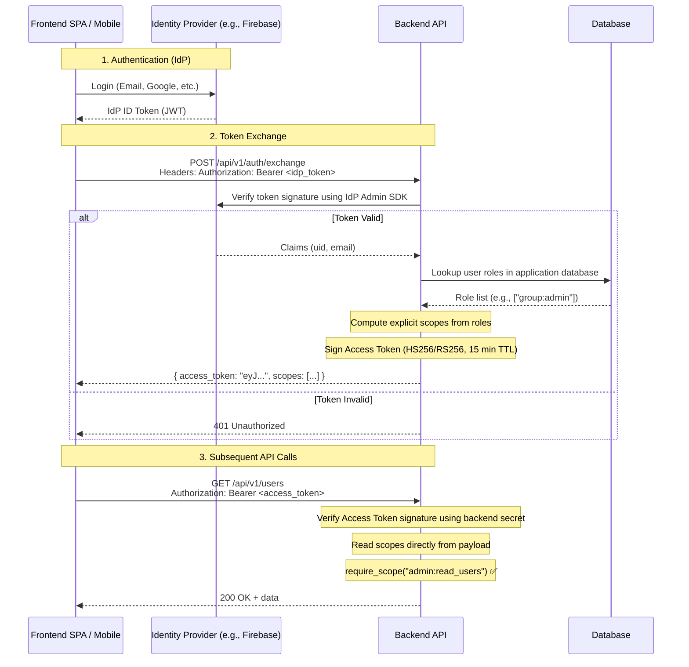
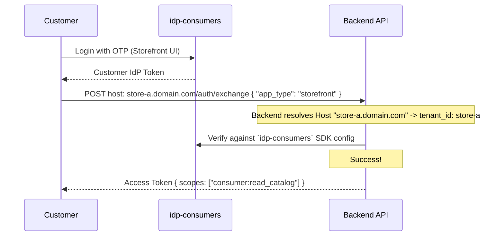
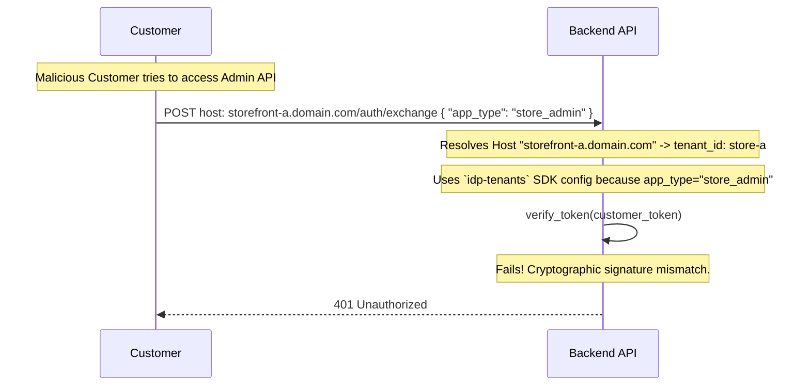

# Architecture Pattern: Scope-Based Token Exchange

> **Domain**: Microservices / Identity & Access Management  
> **Pattern Type**: Authentication & Authorization (AuthN/AuthZ)  
> **Status**: Recommended Pattern

## 1. Overview

This pattern defines a robust Authentication and Authorization (AuthN/AuthZ) architecture for modern web applications. It utilizes a **Token Exchange Pattern** that bridges a 3rd-party Identity Provider (IdP) (e.g., Firebase, Auth0, Cognito) with a custom, backend-issued JWT.

### Core Philosophy
- **Authentication (AuthN)** is delegated entirely to the IdP. The backend never handles raw passwords, social logins, or MFA verification.
- **Authorization (AuthZ)** is handled entirely by the backend via a self-signed, short-lived Access Token containing explicit permission `scopes`.
- **Decoupling**: The backend is not tightly coupled to the IdP's token format or limitations on custom claims.

---

## 2. The Token Exchange Flow

The backend does **not** routinely verify the IdP token on every API request. Instead, it uses a one-time token exchange upon login.


```mermaid
sequenceDiagram
    participant Client as Frontend SPA / Mobile
    participant IdP as Identity Provider (e.g., Firebase)
    participant Backend as Backend API
    participant DB as Database

    Note over Client, IdP: 1. Authentication (IdP)
    Client->>IdP: Login (Email, Google, etc.)
    IdP-->>Client: IdP ID Token (JWT)

    Note over Client, Backend: 2. Token Exchange
    Client->>Backend: POST /api/v1/auth/exchange<br/>Headers: Authorization: Bearer <idp_token>

    Backend->>IdP: Verify token signature using IdP Admin SDK

    alt Token Valid
        IdP-->>Backend: Claims (uid, email)
        Backend->>DB: Lookup user roles in application database
        DB-->>Backend: Role list (e.g., ["group:admin"])
        Note over Backend: Compute explicit scopes from roles
        Note over Backend: Sign Access Token (HS256/RS256, 15 min TTL)
        Backend-->>Client: { access_token: "eyJ...", scopes: [...] }
    else Token Invalid
        Backend-->>Client: 401 Unauthorized
    end

    Note over Client, Backend: 3. Subsequent API Calls
    Client->>Backend: GET /api/v1/users<br/>Authorization: Bearer <access_token>
    Note over Backend: Verify Access Token signature using backend secret
    Note over Backend: Read scopes directly from payload
    Note over Backend: require_scope("admin:read_users") ✅
    Backend-->>Client: 200 OK + data
```

---

## 3. Token Architectures

### 3.1 IdP Token (Input — Issued by IdP)
```json
{
  "iss": "https://securetoken.domain.com/my-project",
  "sub": "idp_uid_abc123",
  "email": "user@example.com",
  "exp": 1709061600
}
```
The backend exchange endpoint uses the IdP SDK to securely verify this signature. Used **once** at `/auth/exchange`.

### 3.2 Access Token (Output — Issued by Backend)
```json
{
  "iss": "platform-backend",
  "sub": "idp_uid_abc123",
  "scopes": ["admin:read_users", "admin:write_users"],
  "exp": 1709061600
}
```
Signed by the backend using its own symmetric (`HS256`) or asymmetric (`RS256`) key. This token is short-lived (e.g., 15 minutes) and is sent on **every subsequent API request**.

---

## 4. Vocabulary & The Scope System

### 4.1 Naming Convention
A scope represents a concrete permission formulated as: `{context}:{action}_{resource}`
- `context`: Usually `admin`, `api`, or `user`.
- `action`: `read`, `write`, `manage`, or a domain-specific action.
- `resource`: The domain entity being accessed.

**Examples:**
- `admin:read_users` — View user records.
- `user:manage_own_profile` — Action restricted to the authenticated user.

### 4.2 Role-to-Scope Bundles (The PDP)

The backend determines scopes by mapping database Roles/Groups to specific Scopes.

```python
ROLE_SCOPES: dict[str, list[str]] = {
    "group:admin": [
        "admin:read_users", "admin:write_users",
        "admin:manage_settings", "admin:read_reports",
    ],
    "group:viewer": [
        "admin:read_users", "admin:read_reports",
    ],
}
```

### 4.3 Scope Enforcement (Dependency Injection)

Use framework-level dependencies (e.g., FastAPI `Depends`, Express Middlewares, Spring Annotations) to enforce scopes at the route level.

```python
# Refuses request if App token lacks the EXACT required scope
@router.post("/users")
async def create_user(
    payload: UserCreate,
    auth: AccessTokenContext = Depends(require_scope("admin:write_users"))
):
    ...

# Example: Multiple scopes (OR condition)
# Route can be called if token has EITHER "write_users" OR a special "override" scope
@router.post("/users/{id}/force-reset")
async def force_reset(
    id: str,
    auth: AccessTokenContext = Depends(require_any_scope("admin:write_users", "platform:override"))
):
    ...

# Example: Multiple scopes (AND condition)
# Route requires BOTH scopes to be present in the token
@router.post("/financials/export")
async def export_data(
    auth: AccessTokenContext = Depends(require_all_scopes("admin:read_reports", "admin:export_data"))
):
    ...
```

---

## 5. Security Characteristics for Single Apps

1.  **Stateless API Security**: The backend API requires **zero** database calls to authorize requests. Token verification and scope checking are pure CPU operations.
2.  **No IdP Rate Limits**: By not checking the IdP token on every request, the backend is insulated from IdP network latency and API rate limits.
3.  **Ultimate Control**: The application decides exactly what scopes go into the Access Token, without wrestling with maximum token size limits or custom claim synchronizations in the 3rd-party IdP.

---

## 6. Extension: The Multi-Tenant SaaS Scenario

This token exchange pattern becomes uniquely powerful when scaling a single application into a **B2B Multi-Tenant SaaS platform** with multiple user surfaces (e.g., a B2C Storefront, a B2B Tenant Admin, and an Internal SaaS Control Center).

### 6.1 The Challenge of Multi-Tenancy
In complex SaaS, users belong to different trust domains. A consumer buying a product belongs to a different trust domain than a staff member managing the store, who belongs to a different trust domain than a platform engineer managing the whole SaaS.

Using one giant IdP user pool for everyone risks catastrophic cross-contamination (e.g., a "consumer" token accidentally gaining access to an "admin" endpoint due to a logic flaw).

### 6.2 The Solution: Multi-IdP Cryptographic Isolation

The Token Exchange pattern solves this elegantly by routing the initial exchange request to completely separate IdP projects based on the surface the user is logging into. 

**Example: A Shopify-Style E-Commerce Platform**
To ensure absolute isolation, the platform provisions three separate Firebase Projects (or Auth0 Tenants):

| Application Surface | Target User | IdP Project Isolation | Auth Methods |
|---|---|---|---|
| **`{store}.myshopify.com`** (Storefront) | B2C Customers buying products | Firebase Project: `shopify-customers` | Phone/OTP, Social Login, Guest |
| **`admin.shopify.com`** (Store Admin) | B2B Merchants managing their stores | Firebase Project: `shopify-merchants` | Email/Password + MFA |
| **`internal.shopify.com`** (Support) | Internal Shopify Staff providing support | Firebase Project: `shopify-internal` | Corporate SSO only |

If a user is both a consumer who bought a t-shirt at Store A and a merchant who runs Store B, they possess two separate identities in two separate Firebase projects. This is a critical security boundary: a compromised customer credential physically cannot authenticate against the `shopify-merchants` project.

### 6.3 Adapting the Exchange Flow for SaaS

1.  **Input Requirement**: The exchange payload only accepts the `app_type`. For example: `POST /auth/exchange { "app_type": "storefront" }`.
2.  **Domain Resolution**: The backend dynamically resolves the correct `tenant_id` by inspecting the HTTP `Host` header of the incoming request (e.g., mapping `store-a.myshopify.com` to `tenant_id: "store-a"`). The frontend never explicitly passes a tenant ID, ensuring it cannot easily spoof a different tenant context.
3.  **Verification Routing**: The backend checks `app_type` and verifies the token against only the corresponding IdP SDK configuration. A token issued by `shopify-customers` **cryptographically fails** if submitted to the exchange endpoint with `app_type="store_admin"`.
4.  **Contextual Tokens**: The output Access Token bakes the resolved `tenant_id` and explicitly requested `app_type` into the payload.

```json
{
  "iss": "platform-backend",
  "sub": "idp_uid_abc123",
  "tenant": "tenant-a",
  "app_type": "tenant_admin",
  "scopes": ["tenant:read_records", "tenant:write_records"]
}
```

### 6.4 Sequence Diagrams for SaaS Scenarios

#### Scenario 1: Storefront Customer Login

```mermaid
sequenceDiagram
    participant Cust as Customer
    participant IdP as idp-consumers
    participant API as Backend API

    Cust->>IdP: Login with OTP (Storefront UI)
    IdP-->>Cust: Customer IdP Token
    Cust->>API: POST host: store-a.domain.com/auth/exchange { "app_type": "storefront" }
    Note over API: Backend resolves Host "store-a.domain.com" -> tenant_id: store-a
    API->>IdP: Verify against `idp-consumers` SDK config
    Note over API: Success!
    API-->>Cust: Access Token { scopes: ["consumer:read_catalog"] }
```

#### Scenario 2: Cross-Surface Access Attempt (Blocked)

```mermaid
sequenceDiagram
    participant Cust as Customer
    participant API as Backend API

    Note over Cust: Malicious Customer tries to access Admin API
    Cust->>API: POST host: storefront-a.domain.com/auth/exchange { "app_type": "store_admin" }
    Note over API: Resolves Host "storefront-a.domain.com" -> tenant_id: store-a
    Note over API: Uses `idp-tenants` SDK config because app_type="store_admin"
    API->>API: verify_token(customer_token)
    Note over API: Fails! Cryptographic signature mismatch.
    API-->>Cust: 401 Unauthorized
```

### 6.5 Why it works so brilliantly for SaaS

- **Row-Level Isolation**: The backend reads the `tenant` directly from the validated Access Token signature and injects it into all database queries automatically. Users cannot "switch" tenants by manipulating a URL or header; they must perform a new `/exchange` to prove they have access to the new tenant.
- **Scope Escalation Prevention**: The `app_type` is baked into the scope grammar (`admin:write_products` vs `consumer:read_catalog`). A consumer token physically never possesses the `admin:` prefix scopes.
- **Blast Radius Containment**: A compromised API key for the `shopify-customers` Firebase project cannot be used to forge tokens for the `shopify-merchants` admin portal or the internal support center.
